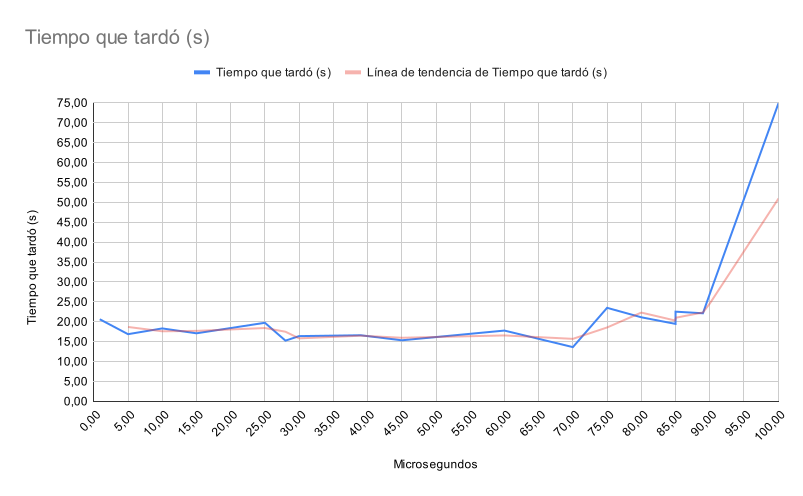

# Enunciado

Ejercicio 12 [delayed_busy_wait]

Espera activa con retraso. ¿Se corrige el problema de la espera activa si en lugar de tener un ciclo vacío, se espera un cierto tiempo? Copie su carpeta ejemplos/pthreads/hello_order_busywait a ejercicios/pthreads/delayed_busy_wait. Permita que el usuario pueda invocar su programa con un segundo argumento de línea de comandos que indica la cantidad de microsegundos a esperar cuando no es el turno del hilo de ejecución, algo como:

// Wait until it is my turn
while (next_thread < my_thread_id) {
  usleep(delay);
}

Recuerde probar la calidad de su código. Luego ejecute al menos tres veces su solución (sin sanitizers) con la cantidad máxima de hilos de ejecución que su sistema operativo le permite crear y una espera de 50µs. Escriba en el readme.md del ejercicio la mayor de las duraciones que obtuvo de sus corridas. ¿Hubo una mejora de la espera constante respecto a la espera activa pura?

Altere su solución al ejercicio para que en lugar de esperar exactamente la cantidad de microsegundos indicada por el usuario, espere por una cantidad pseudoaleatoria de microsegundos cuyo límite es el número indicado por el usuario. Sugerencia: puede usar compilación condicional para implementar esta variación. Ejecute al menos tres veces su solución pseudoaleatoria con la cantidad máxima de hilos y un máximo de espera de 50µs. Tome la mayor de las duraciones. ¿Hubo una mejora de la espera pseudoaleatoria respecto a la espera constante?

¿Mejora el tiempo de ejecución si disminuye o incrementa la espera máxima de los hilos? Haga al menos un par de ejecuciones con un tiempo menor y otro mayor a los 50µs. Sugerencia: si hay varios compañeros(as) trabajando el mismo ejercicio en el laboratorio, escojan tiempos diferentes y compartan los resultados. Pueden crear una gráfica en un documento compartido.

Agregue la gráfica al readme.md del ejercicio y una discusión de a lo sumo dos párrafos. Indique cuál fue el mejor tiempo máximo de espera obtenido y los efectos de disminuir o incrementarlo. Conjeture y trate de explicar por qué ocurre este comportamiento. Finalmente indique si la espera activa con retraso es una solución óptima, y en caso negativo, provea una idea que pueda lograr este ideal.

## Ejercicios

### Tiempo transcurrido: 
    
    22.125539s

### ¿Hubo una mejora de la espera pseudoaleatoria respecto a la espera constante? 
    
    Si, ya que la espera constante no termino cuando el delay ya lo habia hecho 
    
### ¿Mejora el tiempo de ejecución si disminuye o incrementa la espera máxima de los hilos?

#### Sin Random
Microsegundos	Tiempo que tardó (s)
20               15.554306s
40               16.539538s
60               21.972145s
80               22.641810s

#### Con random

Microsegundos	Tiempo que tardó (s)
100	                74,71
10              	18,33
85              	19,47
70              	13,63
75              	23,50
25	                19,75
15	                17,10
1	                20,51
90	                26,99
80	                21,13
5	                35,26
85	                22,54
39	                16,61
89	                15,39
30	                16,40
45	                15,35
28	                15,26

##### Grafico

Elaboracion en conjunto:
* Daniel Perez
* Emilia Viquez
* Albverto Gonzales
* Sebastian Solano
* Angie Solis
* Luis Solano