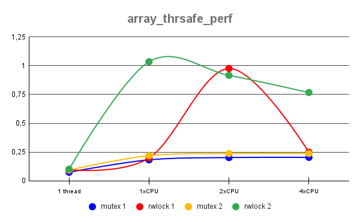

# array_thrsafe_perf(*Resultados*)

## Tabla de duraciones

|**Threads**     |         |            |           |           |           |
|----------------|---------|------------|-----------|-----------|-----------|
|**distribution**|**array**|**1 thread**|**1xCPU**  |**2xCPU**  |**4xCPU**  |
|**10-10-80**    |mutex 1  |0,074222487 |0,182052761|0,201776523|0,203477507|
|**10-10-80**    |rwlock 1 |0,096100286 |0,198199779|0,976889653|0,248146616|
|**.1-.1-99.8**  |mutex 2  |0,093229608 |0,218820348|0,236612157|0,236956848|
|**.1-.1-99.8**  |rwlock 2 |0,101129542 |1,0352545  |0,916864886|0,767291687|

## Grafico

## Análisis

En este análisis podemos observar como el control de concurrencia mediante un rwlock provocó que la duración
de ejecución del programa aumentará considerablemente mucho, esto con respecto al control de concurrencia del
mutex. Sin embargo es importante observar que conforme se incremente el nivel de concurrencia, el mutex
incrementa de manera mínima, prácticamente pasa a ser constante y por el lado del rwlock, este comienza
adecrecer, dando a entender que entre mayor el grado de concurrencia entonces mas eficiente y rapido sera
este control de concurrencia.

Para poder obtener mejores resultados, será necesario la implementación de más casos grandes de prueba y de
un gran nivel de concurrencia.

