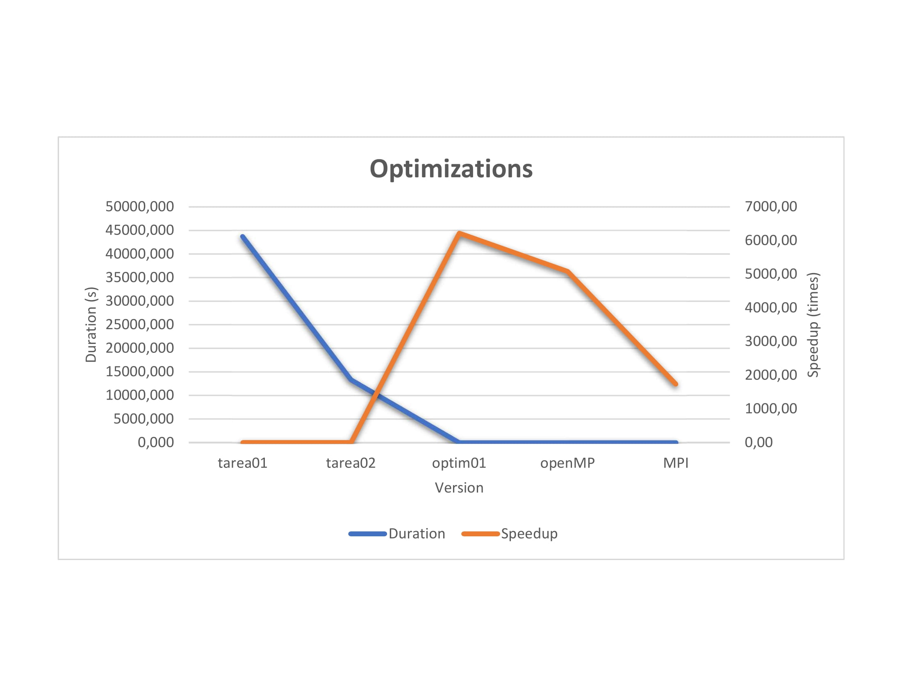
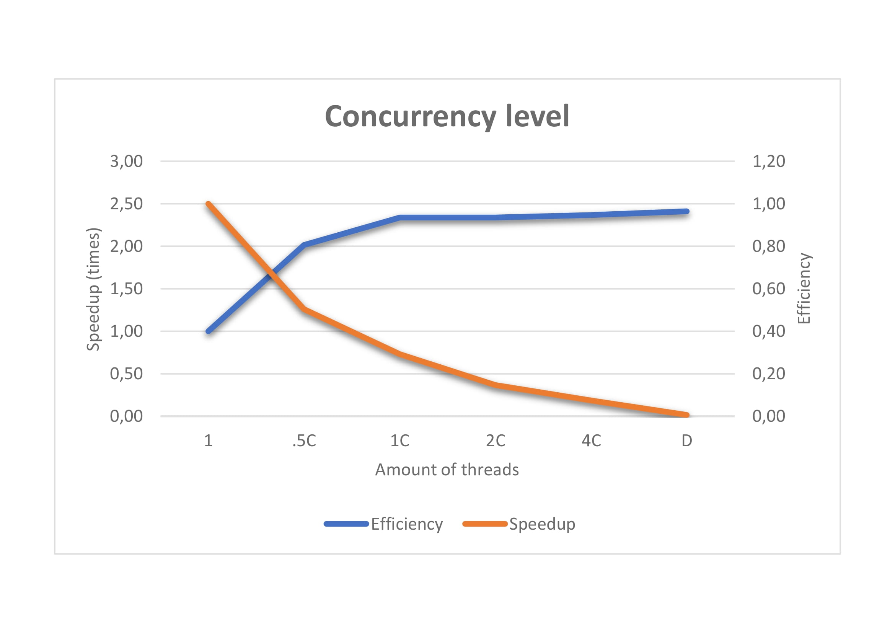

# Comparación de optimizaciones

## Reporte 01: Optimización pthreads | Mapeo dinamico

#### Rendimiento del código antes de realizar las modificaciones.

Hasta el momento de la implementación de esta optimización tenemos un código serial con el cual se le vuelve casi imposible correr los casos
medianos de prueba ya que su tiempo para realizar esta sumas se vuelve realmente alto, tardando así en la pruebas un tiempo de 43715,514879302
segundos.

#### Regiones a optimizar.

Para esta tarea se desea optimizar:

1. Ejecución serial del programa.

#### Modificaciones que se cree incrementarán el rendimiento en las regiones críticas.

1. Colocar a la cantidad de hilos brindados por el usuario a resolver las sumas de Goldbacha propuestas y seguidamente de esto los hilos dividen el
trabajo mediante mapeo dinámico, lo que quiere decir que cada hilo consume el siguiente número disponible y así hasta el final.

#### Indiferentemente de si se incrementó o no el rendimiento, documentar las lecciones aprendidas, ya que servirán para otros desarrolladores que intenten optimizar la misma sección de código.

El resultado de esta optimización a nivel de tiempo fue exitoso ya que se logró una reducción, que iba desde 43715,514879302 segundos a una actual
de 13358,467327884 segundos con 8 hilos de ejecución y además un speedup de 3,272494801 con una eficiencia de 0,4090618501. De lo anterior podemos
deducir que la mejora es notable ya que reduce el tiempo en casi 1/4 del anterior, sin embargo la eficiencia no termina de ser la esperada por lo
que aún se podrían lograr mejores resultados.

## Reporte 02: Optimización KCachgrind

#### Rendimiento del código antes de realizar las modificaciones.

Hasta este punto se ha logrado que el programa logre calcular sumas de goldbach en un menor tiempo que el serial, sin embargo esta optimizaciones aún
no son viables para números muy grandes esto porque el tiempo de espera de estos cálculos es demasiado largo. Y como evidencia de esto tenemos que los
casos medianos tienen una duración de 13358,467327884 segundos, lo cual aún es demasiado lento.

#### Regiones críticas a optimizar (profiling).

Para este proceso se realizó un análisis al código mediante la herramienta KCachgrind, la cual reporta las zonas en las que más tiempo consume.
El resultado de este análisis se puede ver reflejado en la siguiente imagen:

Por lo que a partir de la anterior imagen se busca optimizar las regiones encargadas de:

1. Calculo de numeros primos
2. Ciclos para encontrar sumas de Goldbach
3. Resize de las estructuras de datos encargadas del almacenamiento de
los números y sumas de goldbach

#### Modificaciones que se cree incrementarán el rendimiento en las regiones críticas.

1. Actualmente se calculan los numeros primos a la fuerza, sin embargo existen una función llamada primality test la cual verifica que un número sea
primo con menores ciclos que la función actual. Además se almacenar hasta el mayor número ingresado los resultados de primalidad en un vector de bits,
el cual ayudará a ahorrar espacio y además así evitar recalcular los números primos.
2. Para el algoritmo actual se utiliza un tiempo O(N^2) para encontrar las sumas de goldbach de números pares y un O(n^3) para los números impares.
Sin embargo existe la posibilidad de reducir estos ciclos obteniendo el segundo y tercer dígito respectivo de la resta de los iteradores.
3. En el código tenemos un rize que depende de una constante, sin embargo considero que si hacemos que los resize del programa dependen del número
ingresado por el usuario se podría tener un mejor cálculo de la cantidad de datos que ocupa consumir la máquina. Lo se quiere con esto es que para
números pequeños se consuma una pequeña porción de espacio y para números grandes consuma una gran cantidad de espacio, o de otras palabras que se
consuma espacio respecto al número ingresado.

#### Indiferentemente de si se incrementó o no el rendimiento, documentar las lecciones aprendidas, ya que servirán para otros desarrolladores que intenten optimizar la misma sección de código.

Para esta optimización se lograron resultados muy positivos, iniciando desde el tiempo de ejecución, el cual decrece de manera vertical, por lo que
implicó que el speedup también creciera y lo más importante es que ahora la eficiencia en conjunto a los dos elementos anteriores, por lo que podemos
concluir que aplicar una optimización de este nivel en comparación con los anteriores programas sería algo muy atractivo para cualquier cliente.

## Reporte 03: OpenMp

Para poder poner a prueba algunas de las muchas tecnologias las cuales se encuentran en el ámbito laboral
se ha decidido la implementación de multihilos con *OpenMP* en el la versión más reciente implementada hasta
el momento de la prueba, la cual correspondía a Optim01, para esto únicamente fue necesario la modificación de
pequeñas partes del código en las cuales se utilizaban *pthreads*. Una vez aplicada esta pequeña modificación
obtuvimos que su duración varía en comparación con la versión anterior. Esta modificación provocó que un tiempo de
7.03s pasará a 8,6s. Por esta información recopilada anteriormente se concluye que *OpenMP* al ser un función mucho
más rígida, lo cual provoca que el programado no tenga todo el control de cómo se va a aplicar la concurrencia,
provoca que tenga un mayor tiempo de ejecución que los *pthreads*. Sin embargo la diferencia no es realmente muy
significativa.

## Reporte 04: OpenMp - MPI

En este nuevo reporte hemos decidido implementar una optimización para sumas de Goldbach realmente grandes y que
requieran de escalabilidad, más específicamente en este caso de un *closter*. Para la implementación de esta nueva
optimización se decidió utilizar OpenMP, el cual es el responsable de la paralelización de las sumas de Goldbach,
y MPI, el cual se encarga de la comunicación entre multiprocesos. Una vez implementado este programa se ha obtenido
un tiempo de duración de 25,21s, el cual comparado contra el menor de todas las optimizaciones anteriores(7.03s)
es relativamente más alto. Sin embargo esto es justificable por una razón y esta es que los casos de prueba son
relativamente pequeños, lo cual impide que nuestro programa escale de una forma más efectiva que los anteriores.

# Comparación de optimizaciones

Ahora una vez ya finalizadas las optimizaciones y tomando en cuenta los resultados sobre el tiempo y speedup,
podemos dar una conclusión al respecto de estos trabajos. Primero podemos considerar como la primera optimización
*Tarea02* en la cual se implementaron hilos de ejecución para resolver el programa causó el decremento de una
manera discreta en el tiempo de ejecución. Sin embargo esto se obtuvo a cambio de un costo computacional
relativamente alto como lo son 8 hilos de ejecución. Ahora bien si comparamos la anterior optimización con la
última *Optim01* podemos notar cómo esta última optimización con un menor costo computacional logra obtener
mejores resultados. Como se puede ver en la gráfica inferior, en la cual se aprecia un decremento en el tiempo de
ejecución de una manera exponencial. Una vez analizado lo anterior se puede concluir que no siempre la mejor forma
para optimizar un programa va a ser el incremento de los hilos de ejecución. Esto debido a que si un programa de
manera serial contiene constantes de proporcionalidad altas y ciclos muy costosos, estos se van a propagar por la
implementación de un código con varios hilos de ejecución, evitando así un buen desarrollo y desempeño del
programa. Por parte de la implementación con la tecnología *OpenMP* hemos obtenido un costo relativamente muy
cercano a la *Optim01*, recalcando que su tiempo incremento relativamente un poco, pero todo esto a cambio de
un menor costo de implementación para el programador por lo cual se puede considerar como una solución bastante
viable. Finalmente con respecto a la implementación con las tecnologías *OpenMp - MPI* no hemos podido ver su
verdadera utilidad a gran escala, sin embargo sus tiempos en baja escala siguen siendo positivos, pero no mejores
a *Optim01*, por lo que podemos decir que esta solución está principalmente basada en muchos y muy grandes números.

# Grado de concurrencia(Optim01)

En este apartado se desea llegar a una conclusión sobre cuál debe ser los grados de concurrencia para la
optimización *Optim01*. Para esta discusión se adjunto un gráfico en la parte inferior, el cual
muestra los resultados obtenidos de un análisis a partir de varias ejecuciones en el programa, con distintos
números de hilos. Estos resultados incluyen speedup y efficiency, por lo que este gráfico únicamente compara estos
dos elementos. Algunos aspectos a destacar sobre el análisis realizado es la intersección que se visualiza en el
gráfico entre el eje de eficiencia y el eje de speedup. Además debemos que tener en cuenta que el rendimiento es
un resultado es importante para todo programa, esto para lograr un buen uso
de los recursos computacionales, en este caso podemos utilizar el speedup y eficiencia para concluir cuál grado de
concurrencia nos daría el mejor rendimiento. Tomando en cuenta al gráfico podemos concluir que la intersección 
del eje de eficiencia y speedup, el cual está aproximadamente sobre
los 4 hilos de ejecución, es el punto donde se alcanza un mejor rendimiento. Esto porque el gasto computacional
genera un incremento de rendimiento valioso en comparación con la eficiencia y speedup obtenido.

# Tablas de resultados de optimizaciones

CPU C = 8
Test File: Input029.txt
Input Size: 382

## Optimizations

|Level|Tarea01|Tarea02|Optim01|Open MP|MPI|
|-----|-----|-----|-----|-----|-----|
|Threads|1|8|8|8|24|
|Duration|43715.51|13358.47|7.03|8.6|25.2|
|Speedup|1|3.27|6216.17|5085,9|1734.01|

## Concurrency Level(Optim01)

|Level|1|.5C|1C|2C|4C|D|
|-----|-----|-----|-----|-----|-----|-----|
|Threads|1|4|8|16|32|382|
|Duration|16.44|8.17|7.03|7.03|6.94|6.82|
|Speedup|1|2.013|2.34|2.34|2.37|2.41|
|Efficiency|1|0.5|0.28|0.14|0.07|0.01|

