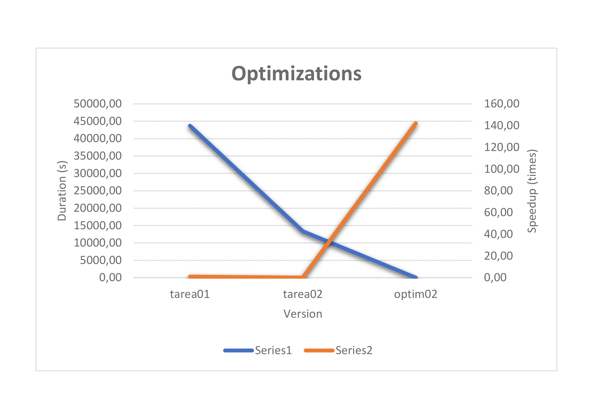
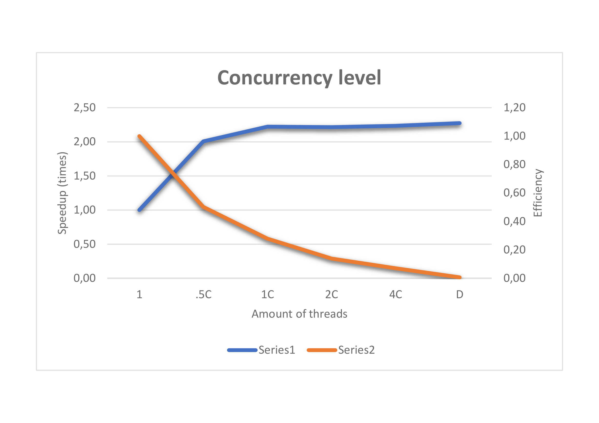

# Reportes de Optimización

## Reporte 01 Optimización Pthreads Dinamicos

#### Rendimiento del código antes de realizar las modificaciones.

Hasta el momento de la implementacion de esta optimizacionn tenemos uncodigo serial
el cual se le vuelve casi imposible correr los casos medianos de prueba ya que su tiempo
para realizar esta sumas se vuelve realmente alto, tardanto asi en la pruebas un tiempo
de 43715,514879302 segundos

#### Regiones críticas a optimizar (profiling).

Para este profiling se desea optimizar:

1. Ejecucion serial del programa

#### Modificaciones que se cree incrementarán el rendimiento en las regiones críticas.

1. Colocar a la cantidad de hilos brindados por el usuario a resolver las sumas de goldbacha
propuestas y seguidamente de esto los hilos divinden el trabajo de una manera dinamica, lo que
quiere decir que cada hilo consume el siguiente numero disponible y asi hasta el final.

#### Indiferentemente de si se incrementó o no el rendimiento, documentar las lecciones aprendidas, ya que servirán para otros desarrolladores que intenten optimizar la misma sección de código.

El resultado de esta optimizacion a nivel de tiempo fue exitoso ya que se logro una reduccion, que
iba desde 43715,514879302 segundos a una actual de 13358,467327884 segundos con 8 hilos de ejecucion
y ademas un speedup de 3,272494801 con una eficiencia de 0,4090618501. De lo anterior podemos deducir
que la mejora es notable ya que reduce el tiempo en casi 1/4 del anterior, sin embargo la eficiencia no
termina de ser la esperada por lo que aun se podrian lograr mejores resultados.

## Reporte 02 Optimización

#### Rendimiento del código antes de realizar las modificaciones.

Hasta este punto se ha logrado que el programa logre calcular sumas de goldbach en un menor
tiempo que el serial, sin mebargo esta optimizaciones aun no son viables para numeros muy grandes
esto porque el tiempo de espera de estos calculos es demasido largo. Y como evidencia de esto tenemos
que los casos medianos tienen una duracion de 13358,467327884 segundos, lo cual aun es demasido lento.

#### Regiones críticas a optimizar (profiling).

Para este proceso se realizo un analisis al codigo mediante la herramienta KCachgrind, la cual reporta las zonas en
las que mas tiempo consume. El resultado de este anailisis se puede ver reflejado en la siguiente imagen:

Por lo que a partir de la anterior imagen se busca optimizar las regiones encargadas de:

1. Calculo de numeros primos
2. Ciclos para encontrar sumas de Goldbach
3. Resize de las estructuras de datos encargadas de el amacenanamiento de
los numeros y sumas de goldbach

#### Modificaciones que se cree incrementarán el rendimiento en las regiones críticas.

1. Actualmente se calculan los numeros primos a la fuerza, sin embargo existen una funcion
llamada primality test la cual verifica que un numero sea primo con menores ciclos que la
funcion actual. Ademas se almacenar hasta el mayor numero ingresado los resultados de
primalidad en un vector de bits, el cual ayudara a ahorra espacio y ademas asi evitar recalcular
los numeros primos.
2. Para el algoritmo actual se utilizan un tiempo O(N^2) para encontrar las sumas de golbach
de numeros pares y un O(n^3) para los numeros impares. Sin embargo existe la posibilidad de reducir
estos ciclos obteniendo el segundo y tercer digito repectivo de la resta de los iteradores.
3. En el codigo tenemos un rize que depende de una constante, sin embargo considero que si hacemos
que los resize del programa dependan del numero ingresado por el usuario se podria tener un mejor calculo
de la cantidad de datos que ocupa consumir la maquina. Lo se quiere con esto es que para numeros pequenos
se consuma una pequena porcion de espacio y para numeros grandes consuma una gran cantidad de espacio
respecto a ese numero.

#### Indiferentemente de si se incrementó o no el rendimiento, documentar las lecciones aprendidas, ya que servirán para otros desarrolladores que intenten optimizar la misma sección de código.

Para esta optimizacion se lograron resultados muy positivos, iniciando desde el tiempo de ejecucion, el cual decrecion
de manera vertical, por lo que implico que el speedup tambien creciera y lo mas importante es que ahora la eficiencia
en conjunto a los dos elementos anteriores, por lo que podemos concluir que aplicar una optimizacion de este nivel en
comparacion con los anteriores programas seria algo muy atractivo para cualquier cliente.

## Tablas de Optimizaciones

# Comparación de optimizaciones

# Grado de concurencia

