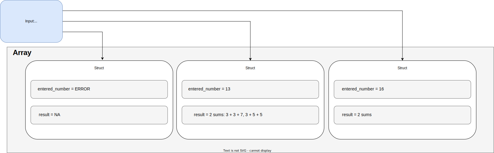

# Diseño General De Estructura De La Datos
 
## Descripción
 
El diseño de la estructura de datos implementada se basa en el concepto de **array**, el cual almacena un **struct**, el cual contiene las variables: **entered_number** y **result**.
 
* **entered_number:** Almacena el número ingresado por el usuario.
 
* **result:** Almacena el resultado del cálculo de las sumas de Goldbach.
 
## Ilustración:
 
En la ilustración inferior se muestra un pequeño caso de 3 dígitos(1 primo, 1 par y 1 invitado), en el cual se puede mostrar la implementación de la estructura creada y como se propuso el ingreso de datos a esta, representada por la caja de **Input**.
 
