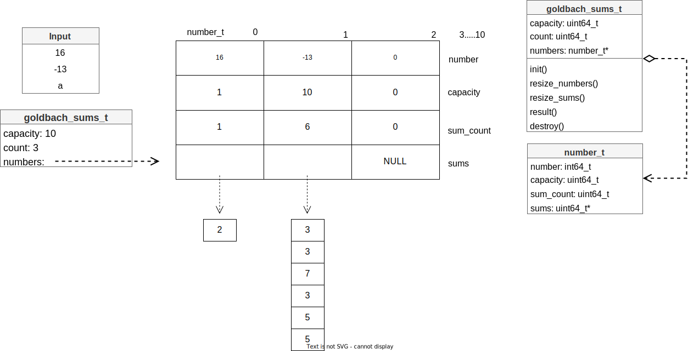

# Diseño general de estructura de datos
 
## Descripción
 
Se genero un diseño para la estructura de datos implementada en una clase GlobalDataStructure, con algunos métodos, la cual se encarga de manipular un contenedor de tipo **array** y su respectivo tamaño, el array implementado será responsable de almacenar varios punteros a un **struct**, esta estructura a su vez será la responsable de almacenar un número entero, un booleano indicando si el número es par, un booleano indicando si el número contiene un signo negativo y finalmente el string el cual devolverá al usuario.

### Datos

* size
* iterator
* array
    * struct
        * number
        * even_number
        * unsigned
        * string_result

### Métodos

* **init:** Se encarga de inicializar toda la estructura de datos.
* **add:** Se encarga de agregar un nuevo struct al vector en su última posición.
* **get_structur:** Se encarga de devolver un puntero de un struct en específico.
* **get_size:** Retorna la dimensión del array.
* **free_global_data_structure:** Libera todo lo que contiene la estructura de datos.
 
## Ilustración
 
### Estructura de datos

### Ejemplo

